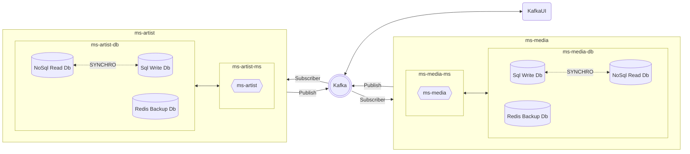

# hexagonal-cqrs-proof

Microservices in a multimodule Maven project with Hexagonal Architecture, CQRS, and Kafka for synchronizing databases

**Components**
- [Kafka](https://kafka.apache.org/) [9092] + [9093] 
- [Kafka-UI](https://docs.kafka-ui.provectus.io/) [8080]
- REST API ms-artist with [OpenApi Swagger](https://swagger.io/) and two separate DB for R/RW actions [8081]
- REST API ms-media with [OpenApi Swagger](https://swagger.io/) and two separate DB for R/RW actions [8082]
- [Redis](https://redis.io/) DB in every microservice work as caches to store ID references for other REST APIs



## Table of contents

- [Installation](#installation)
- [Usage](#usage)
- [It's not a bug, it's a feature](#features)
- [Maintainers](#maintainers)
- [License](#license)


## Installation

1. First of all clone or download the project.

1. Inside the main folder, you could find two docker-compose yaml files.

1. From there use the command line to start the project in dev or production mode

```
    **Generate .jar**
    mvn clean package
    
    **Developing mode**  
    docker-compose -f docker-compose-dev.yml up -d

    **Production mode**
    docker-compose -f docker-compose-prod.yml up -d
```
      
The dev environment is ready for using with your IDE. The microservice attempts to communicate with Kafka using the local host. In production, it uses the archive Dockerfile to build an image of the project, so you wont need the IDE.
   
4. You could stop the project and free resources with any of these orders

```
    **Developing mode**
    docker-compose -f docker-compose-dev.yml down --rmi local -v
      
    **Production mode**
    docker-compose -f docker-compose-prod.yml down --rmi local -v  
```
   
## Usage

First of all, please visit the REST API documentation. Replace ${port} for the suitable microservice port:

    http://localhost:${port}/swagger-ui/index.html
    
[Kafka-UI](https://docs.kafka-ui.provectus.io/) allow you to check your [Kafka](https://kafka.apache.org/) server using a practical dashboard, so visit the following url:

    http://localhost:8080
    

## Features

#### :white_check_mark: Unit testing for business logic classes

#### :white_check_mark: Include two docker-compose yaml files for easy change of environment

#### :white_check_mark: Hexagonal Architecture following Clean Architecture principle

#### :white_check_mark: CQRS pattern with independent databases for Read or RW actions

#### :white_check_mark: DB synchronization by Publisher-Subscriber pattern

#### :white_check_mark: Redis DB in every microservice work as caches to store ID references for other REST APIs


## Maintainers

Just me, [Iván](https://github.com/Ivan-Montes) :sweat_smile:


## License

[GPLv3 license](https://choosealicense.com/licenses/gpl-3.0/)


---


[](https://www.java.com/es/)
[](https://https://maven.apache.org/)
[](https://spring.io)
[](https://github.com)
[](https://https://eclipse.org/)
[](https://www.sonarsource.com/products/sonarqube/downloads/)
[](https://www.docker.com/)
[](https://kafka.apache.org/)
[](https://choosealicense.com/licenses/gpl-3.0/)